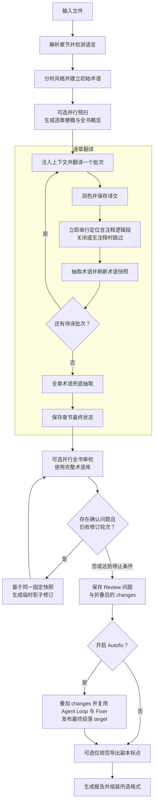

<div align="center">

<h1>
  
  <br>
  
</h1>

**让故事跨越语言。**

面向书籍与长篇文字，在全书语境中完成翻译。

全书理解 · 术语一致 · 取证式审校

[](https://www.python.org/)
[](https://github.com/BigDawnGhost/wenyi/actions/workflows/tests.yml)
[](../../LICENSE)
[](https://github.com/BigDawnGhost/wenyi/stargazers)
[](https://discord.gg/sM3AQcF5D2)

[快速开始](#快速开始) · [语言支持](usage.md#多语言互译实验性) · [使用文档](#文档)

[English](../../README.md) | **简体中文**

<a href="https://hellogithub.com/repository/BigDawnGhost/wenyi" target="_blank"></a>

</div>

---

## 目录

- [为什么选择文译](#为什么选择文译)
- [核心特性](#核心特性)
- [快速开始](#快速开始)
- [支持格式](#支持格式)
- [翻译流水线](#翻译流水线)
- [文档](#文档)
- [憧憬与不足](#憧憬与不足)
- [社区](#社区)
- [支持项目](#支持项目)
- [星标历史](#星标历史)
- [许可证](#许可证)

---

## 为什么选择文译

| 常见方案 | 文译 |
|---|---|
| 逐段翻译，彼此孤立，缺乏上下文 | 全书预扫 + 逐章梗概 + 滚动上下文 |
| 术语靠人工事后整理 | 翻译中实时抽取专有名词，自动检测译法冲突，立即影响后续批次 |
| 一次性翻译，中断即作废 | 批次检查点 + 章节状态记录，任意中断后重新执行同一命令即可续跑 |
| 模型直出，无系统性质控 | 翻译 → 润色 → 取证式全书审校 |

文译为**长文本**设计 —— 长篇小说、社科专著、纪实文学……

<p align="center">
  
  <br>
  <sub>双语阅读示例：译文与淡化显示的原文相互对照。</sub>
</p>

---

## 核心特性

- **全书理解** — 翻译前预扫源文，生成逐章梗概和全书概览，注入每批翻译上下文
- **实时术语闭环** — 翻译中自动提取人名、地名、术语和固定表达；检测译法冲突并提示人工裁决
- **多阶段质量保证** — 可选润色（强档模型重译）和取证式全书 AI 审校
- **断点续跑** — 批次级检查点、章节状态记录和原子状态写入；任意中断后重新执行同一命令即可续跑
- **多种 LLM 支持** — DeepSeek、OpenAI、OpenRouter、OrcaRouter、Google Gemini、Ollama、vLLM，以及通用 OpenAI 兼容端点；保留三档位入口，支持按操作独立选模型、混用连接与共享限额。配置见[模型路由](configuration.md#模型与操作路由)。
- **原生 EPUB 回填** — 基于原书 XHTML 模板替换译文片段，尽量保留原书样式、图片、目录和锚点
- **双语对照输出** — 可选原文译文对照版，原文视觉淡化，支持深色模式

---

## 快速开始

### 环境要求

需要 Python 3.10+ 与 [uv](https://docs.astral.sh/uv/)。

### 安装

```bash
git clone https://github.com/BigDawnGhost/wenyi.git
cd wenyi
uv sync
```

### 配置

设置 API 密钥：

```bash
export DEEPSEEK_API_KEY=sk-...
```

### 一键翻译

```bash
uv run trans-novel translate book.epub
```

解析书籍、检测源语言、预扫全书、翻译所有章节、组装输出，一步完成。默认在 `output/` 目录生成单语中文版 `book.zh.epub`。

多语言互译（实验性）：通过 `language.source` / `language.target` 选择方向，例如 `zh → en`、`en → ja`。运行 `uv run trans-novel languages` 查看列表；不同目标使用独立状态和输出文件名。详见[使用指南](usage.md#多语言互译实验性)。


### 分步工作流

```bash
# 1. 译前准备 — 解析、分析、预扫（不翻译正文）
uv run trans-novel prepare book.epub

# 2. 翻译 — 从准备状态续跑
uv run trans-novel translate book.epub

# 3. 独立审校 — 基于最终术语库的逐章审校
uv run trans-novel review book.epub

# 4. 查看进度
uv run trans-novel status book.epub
```

### 中断续跑

每个完成的批次立即持久化。中断后重新执行同一命令即可续跑：

```bash
uv run trans-novel translate book.epub
```

### 命令行覆盖

```bash
uv run trans-novel translate book.epub --polish --review          # 开启润色和最终审校
uv run trans-novel translate book.epub --no-polish                # 关闭润色
uv run trans-novel translate book.epub --no-review                # 跳过最终审校
uv run trans-novel translate book.epub --bilingual                # 同时生成双语版
uv run trans-novel translate book.epub --chapter 0                # 仅翻译第一章（索引从 0 开始）
uv run trans-novel translate book.epub --format txt               # 导出为纯文本
```

最终审校默认开启，一键流程会在全书翻译完成、术语库达到最终状态后再统一执行。
可用 `--no-review` 或设置 `pipeline.review: false` 跳过；也可以独立运行 Agent Review：

```bash
uv run trans-novel review book.epub
uv run trans-novel review book.epub --autofix
```

每次 Review 都会从头全量运行，并发检查文本块，并可按需获取跨章证据后处理互相
矛盾的一致性建议。确认的问题可生成仅限本次运行的完整单段影子修订；下一轮从头盲审
只会看到影子译文，不会收到上一轮的问题说明。Review 默认会写回正式章节 `target`；
使用 `--no-autofix` 或设置 `pipeline.review_autofix: false` 可保持只读。开启 Autofix
后，会先应用折叠后的 changes，再让剩余 issues 基于更新译文复用现有 Review Agent Loop
和 Fixer。只有正式段落的 `target`
会被覆盖，完整历史保存在 Review 目录的 `autofix/index.json`；统一结果仍写入
`state/<书名>/targets/<目标语言>/reviews/review-<时间戳>/result.json`。

---

## 支持格式

| 输入 | 输出 |
|---|---|
| EPUB、FB2、TXT、Markdown、HTML、PDF、DOCX | EPUB（单语 / 双语）、TXT、HTML、Markdown、DOCX |
| SRT（影视字幕） | 单语 `.zh.srt`，可选双语 `.zh-bi.srt` |

- PDF 输入默认走 MinerU，首次转换需 `MINERU_API_KEY`，生成的 HTML 会缓存复用。可选 BabelDOC bridge 用于尽量保留版式。
- EPUB 输出尽量保留原书样式、图片、目录和锚点，竖排转为横排以适配中文阅读。
- 源语言默认由模型自动识别，也可在 `config.yaml` 中固定为 ISO 639-1 语言代码。
- `.srt` 由 `translate` 自动识别，走轻量并发路径（无术语库、润色与全书审校）。状态在 `state/srt/<slug>/targets/<目标语言>/`，成品默认写到源文件旁的 `output/`。详见[使用指南](usage.md#srt-字幕)。
- `.docx` 走完整书籍管线：尽量保留标题导航、简易表格、列表与常见字符/段落样式；已译中文用宋体。默认导出 `.zh.docx`（可用 `--format` 覆盖）。详见[使用指南](usage.md#docxword)。

---

## 翻译流水线



启用全书理解时，预扫阶段按可配置并发数并行执行，并且幂等可续跑——已完成的梗概会跨运行复用。翻译过程中，每批获得最新的术语快照和已译上下文，确保代词、术语和语气跨章一致。
Review Fixer 同样会获得风格指南、全书概览、本章梗概、相关术语及邻近原译文，
以保持全书风格；普通 Review 循环中的替换只存在于影子译文中，可选 Autofix 发布
阶段会复用它生成正式段落 target。

---

## 文档

- [使用指南](usage.md) — 安装、Windows 使用、输入输出、断点续跑和独立工作流阶段
- [配置说明](configuration.md) — 模型提供商、源语言、流水线开关、切分与路径配置
- [翻译流程](pipeline.md) — 预扫、术语、上下文、润色、审校和断点续跑如何协作
- [贡献指南](CONTRIBUTING.md) — 开发、测试和贡献要求

公版书翻译生成的状态目录可在 [wenyi-bookcase](https://github.com/BigDawnGhost/wenyi-bookcase) 查看，也欢迎提交分享。请勿提交或分享无授权的版权文本、私人书籍或包含敏感信息的 `state/` 目录。

---

## 憧憬与不足

本项目为作者个人兴趣所开发，旨在为长文本书籍的译介做出一份微薄的努力。现阶段翻译质量仍受限于所选模型的能力：润色和审校阶段会显著增加 token 消耗，开启影子修订后还可能执行多次全书审校与额外 Fixer 调用；极长的书籍可能产生较大的状态目录，PDF 输入默认依赖 MinerU 外部服务（首次转换需 API Key），可选 BabelDOC bridge 保留版式。SRT 字幕走轻量并发路径，不建术语库、不做润色与全书审校，不同目录下同名文件也可能共用同一 `state/srt/<slug>/targets/<目标语言>/`。多语言互译现为实验性功能，支持中、英、日、韩、法、德、西、意、葡、俄及部分变体；真实模型长篇质量仍待验证，CLI 和提示词指令统一使用英语，模型生成的说明性元数据使用翻译目标语言。

未来想让翻译在够准确的前提下更加顺畅，努力从可读向好读迈进。如果你发现了问题，欢迎提交 [Issue](https://github.com/BigDawnGhost/wenyi/issues)；如果你有想法，欢迎在[讨论区](https://github.com/BigDawnGhost/wenyi/discussions)提出；如果你有一定的编程能力，欢迎提交 PR，让这个项目变得更好。👏

---

## 社区

- [Discord 服务器](https://discord.gg/sM3AQcF5D2)
- QQ 群：1055065098
- [GitHub Issues](https://github.com/BigDawnGhost/wenyi/issues) — 问题反馈
- [GitHub Discussions](https://github.com/BigDawnGhost/wenyi/discussions) — 想法与讨论

---

## 支持项目

如果项目对你有帮助，欢迎打赏。

<p align="center">
  
  &nbsp;&nbsp;
  
  <br>
  <sub>微信 · 支付宝</sub>
</p>

---

## 星标历史

<a href="https://star-history.dera.page/#BigDawnGhost/wenyi&type=date&legend=top-left">
 <picture>
   <source media="(prefers-color-scheme: dark)" srcset="https://star-history.dera.page/svg?repos=BigDawnGhost/wenyi&type=date&theme=dark&legend=top-left" />
   <source media="(prefers-color-scheme: light)" srcset="https://star-history.dera.page/svg?repos=BigDawnGhost/wenyi&type=date&legend=top-left" />
   
 </picture>
</a>

---

## 许可证

[MIT](../../LICENSE)

---

## 国内 AtomGit 托管

本项目在 AtomGit 亦有镜像：[https://atomgit.com/BigDawnGhost/wenyi](https://atomgit.com/BigDawnGhost/wenyi)
